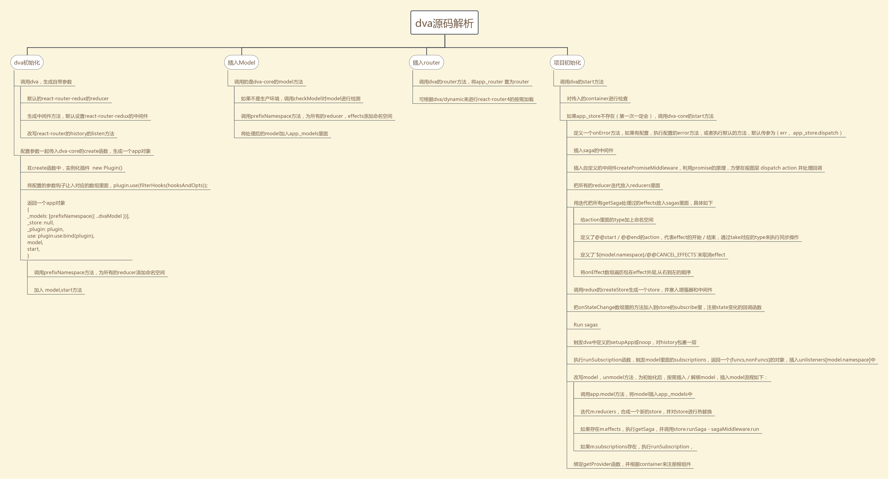
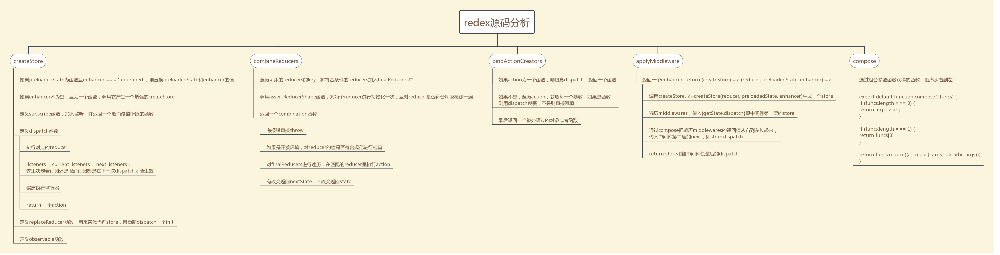

# 前言
dva是阿里开源的一款轻量级，基于 react 和 redux，elm 风格的前端框架，目前已经被很多公司作为基础架构使用，本项目是拉去dva官方项目对react技术栈的源码阅读的总结，上传了node_modules是因为在dva，dva-core，redux里面写了很多标注，方便自己理解，自己也画了张思维导图来尽量概括dva初始化的流程，第一次画有点丑还请见谅。
# dva@2.2.2源码思维导图

# redux@3.7.2 源码思维导图

